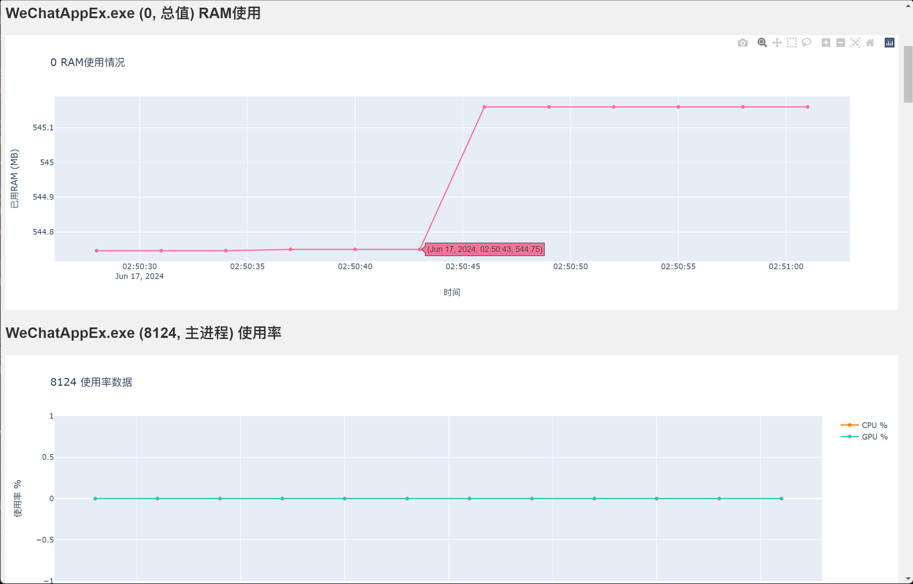

## KProfiler

为 html_pc 项目提供性能监控服务，支持以下功能：

- CPU 占用率采集
- GPU 占用率采集
- RAM 数值采集
- 写入到 csv
- 可视化

## 食用方法

### 1. 安装依赖

```bash
git clone https://github.com/hatsune-miku/kprofiler.git
cd kprofiler
pip install -r requirements.txt
```

### 2. 启动 html_pc 项目

### 3. 修改配置文件 `config.yaml`

目前监控的是微信的进程名，要根据实际情况改成自己想要监控的进程。

### 4. 启动 KProfiler

```bash
python main.py
```

## Demo

以同样基于 electron 的微信小程序 PC 版为例：


