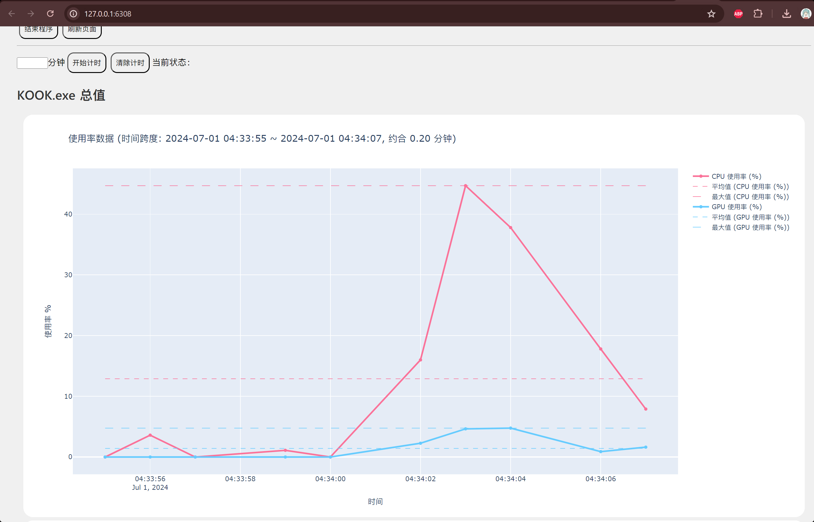

## KProfiler

为 html_pc 项目提供性能监控服务，支持以下功能：

- CPU 占用率采集
- GPU 占用率采集
- RAM 数值采集
- 实时数据可视化
- 计时数据可视化
- 简单数据分析（平均数/最大最小值等）
- 写入到 csv

## 食用方法

### 1. 安装依赖

```bash
git clone https://github.com/hatsune-miku/kprofiler.git
cd kprofiler
pip install -r requirements.txt
```

### 2. 启动 html_pc 项目

### 3. 修改配置文件 `config.yaml`

目前监控的是微信的进程名，要根据实际情况改成自己想要监控的进程。

### 4. 启动 KProfiler

```bash
python main.py
```

## 为什么【内存占用】和任务管理器读数不一致？

**因为任务管理器的内存读数是错的。**

好像不太可能，但的确如此，任务管理器的读数偏低，而 resmon (自带的资源监视器) 以及各类专业监控工具 (AIDA64、Process Explorer 等) 的读数是正确且与 KProfiler 一致的。

## 为什么【CPU 占用率】和任务管理器读数不一致？

CPU 占用率的计算方式实在太多了，不同的工具读数都不同，而任务管理器能做到相对准确，原理尚不明确。KProfiler 每秒采样一次，计算一次瞬时 CPU 占用率，因为是瞬时的，所以会有更大波动。

## 为什么【GPU 占用率】和任务管理器读数不一致？

如果 GPU 读数不一致，可能出现了 BUG！因为 GPU 的数据来源是和任务管理器同款的，应当永远是一致的才对。

## Demo

以同样基于 electron 的微信小程序 PC 版为例：


